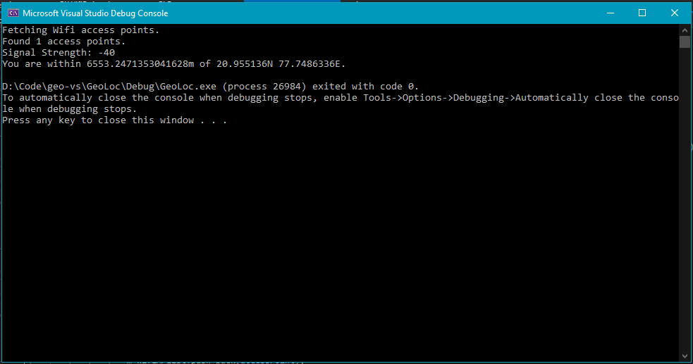

# where-am-i-cpp
C++ project part of the LinkedIn Learning's Code Clinic series.

## Problem: 
You need to figure out your location using wifi access points. You also need to specify the accuracy.

## Installation & test:
0. Clone the repo
1. Ideally use VS Community edition
2. You need to figure out how to statically link libcurl in VS. This link might help: https://stackoverflow.com/questions/53861300/how-do-you-properly-install-libcurl-for-use-in-visual-studio-2017
3. Build using VS.
4. Run main.exe

## Learning objectives:
1. Finding out nearby wifi access points using the windows and wlanapi
2. Use the cjson library to create a json payload 
3. Use the geolocation api by google and consume its json response

